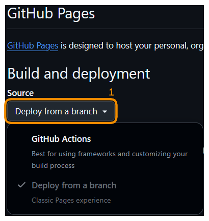
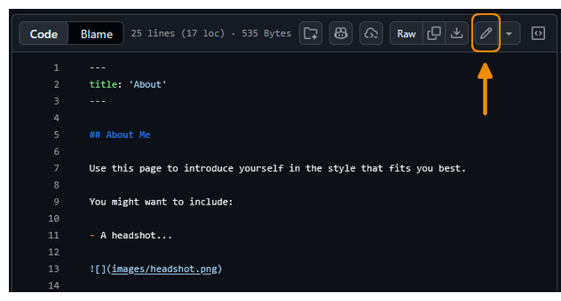
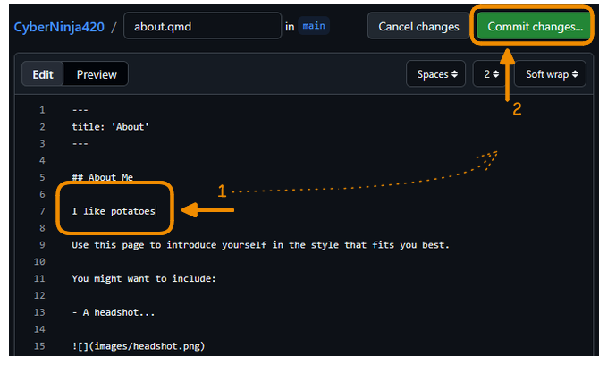
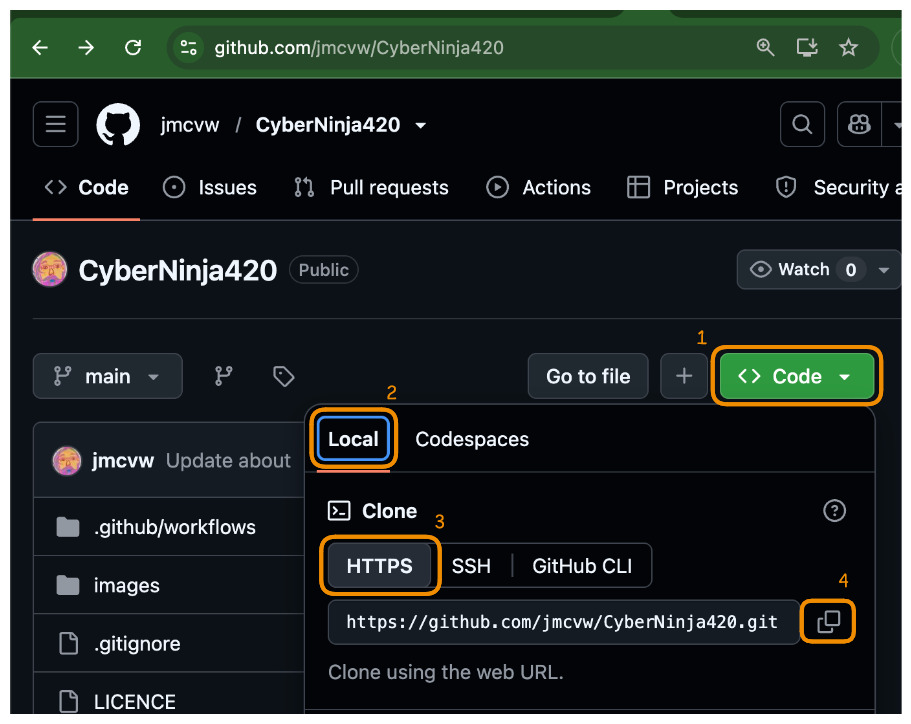
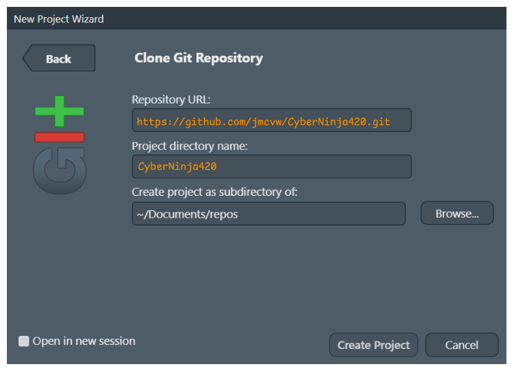
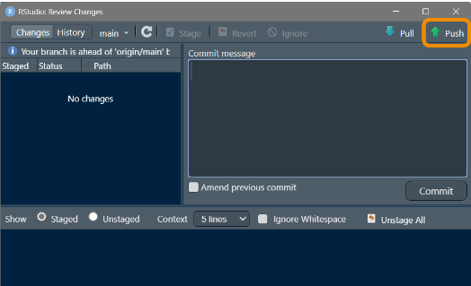
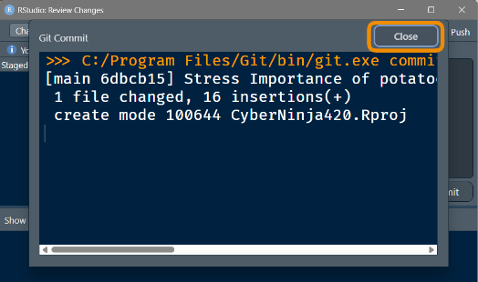

## Before we start

- GitHub account
- R + RStudio installed


## Plan for today

- Create a repo from a __template__
- Configure __automatic deployment__
- Make your first edit to __trigger a build__
- Copy locally 
- Push local changes to trigger another build


## Get Starter Template {.section-intro}

{width=45% fig-align='center'}


## Copy the template

Find the Template repo for creating skills/experience portfolio at:

<https://github.com/TeachHealthData/workshop-portfolio-template>

{width=100%}


Find and click the [Use this template]{.big-green-button} button


## Name your code repository

Chose the name carefully. For example if your GitHub username is `jmcvw` and you call your repo something silly like `CyberNinja420`:

You **code** will live under this address:

:::{.highlight-tip}
[github.com/jmcvw/[CyberNinja420]{style='color: #2e9a40; font-weight: bold;'}]{style='font-family: monospace;'}
:::

You **public website** will live under this address:

:::{.highlight-tip}
[jmcvw.github.io/[CyberNinja420]{style='color: #2e9a40; font-weight: bold;'}]{style='font-family: monospace;'}
:::

And to make your GitHub page appear as your **account home page**...

But if you call it exactly `jmcvw.github.io` (with the `.github.io` bit). Now your **account public website** will be:

:::{.highlight-tip}
[[jmcvw.github.io]{style='color: #2e9a40; font-weight: bold;'}]{style='font-family: monospace;'}
:::

So much shorter, so much prettier!!!

:::{.r-stack}


{.fragment}
:::

## Make it public

- Don't hide your skills!

{width=100%}


## Don't delegate this to AI

:::{.highlight-tip}
May break stuff!
:::

{width=100%}

Copilot may add extra files that interfere with the automated build process


## Now we create the repo

- You're ready to click the big green button [Create repository]{.big-green-button}

:::{.fragment .highlight-success}
You now have your own website repository 👏
:::

## What's in the template?

- `.qmd` files: your pages, written in Markdown
- `_quarto.yml`: site configuration
- `.github/workflows/`: the Actions workflow that builds and publishes your site

:::{.highlight-success}
GitHub Actions will handle everything automatically on every push
:::


## Tell GitHub How to Publish {.section-intro}


## Change `Pages` settings {#scroller .scrollable}

Go to the `Settings` tab in the GitHub website navigation. If your screen is small, it might be hidden under [...]


Then scroll down to `Pages` section on the bottom left.


{width=5% .align-to-top }

## Choose the publish method

Publishing means that all of the changes to your code will be automatically deployment (published) to the web.

Where are two ways to deploy:

:::{.columns}
:::{.column .fragment width='40%'}
**Branches:** (Default) This gives you less control but may be simpler to set up (e.g. if you're pushing pre-rendered HTML files)


:::

:::{.column .fragment width='40%'}
**Actions:** You specifically program what should happen when new code is pushed. We've set it up for you already in the starting code for this workshop **[Choose this]**


:::
:::


## Make changes online {.section-intro}


## Where's our website... is it Published yet?

Since the website gets refreshed every time you make a change... let's make a change (any change) so that it gets published. Technical term is that changing something __triggers__ the `Build Actions`.

So let's make a small change in the `About` page of your new website. Click the __about.qmd__ file.


## Edit a .qmd file and commit your changes

Follow these steps:

:::{.columns}
:::{.column width='60%'}

1. Click the __Pencil__ icon in top right to open file editing view.

:::{.fragment data-fragment-index=1}
2. Change something in the file and click [Commit changes]{.big-green-button}.
:::

:::{.fragment data-fragment-index=2}
3. You will be asked to write a short meaningful message which describes what you've just added (commited)
:::

:::{.fragment .highlight-success}
Your change has triggered an automatic publishing action 🙌
:::

:::

:::{.column width='40%'}
:::{.r-stack}

:::{.fragment .current-visible data-fragment-index=0}

:::

:::{.fragment .current-visible data-fragment-index=1}

:::

:::{.fragment .current-visible data-fragment-index=2}

:::

:::
:::
:::


## GitHub Magic 🦄 {.section-intro}

### Changes to your website code will automatically be published to the web (but it will take a few minutes)

{width='80%' fig-align=center top=100}

## Watch the publishing process 🦄 happen live:

Return to the __Code__ part of the GitHub website navigation


Try to find[^if-yellow-dot-not-there] and click a wee orange dot 

[^if-yellow-dot-not-there]: If you don't see the dot, check in the __Actions__ part of the navigation 

\

:::{.columns .fragment}
:::{.column}
You will be able to see live progress of your website being built 🟠 🔜 ✅  
:::

:::{.column}
:::{.r-stack}
{.fragment .current-visible}

{.fragment .current-visible}

{.fragment .current-visible}

:::{.fragment .highlight-success}
You now have a published website! 🎉

:::
:::
:::
:::

## But where is it? Find your website address

How to be sure exactly what's the **public URL link** where others can see your website?

:::{.columns}
:::{.column .fragment}

1. Return to the __Code__ part of the GitHub website navigation.

2. Go to the editing of __About__ section (wee cog ⚙️ icon).


:::

:::{.column .fragment}

3. Tick an option: __Use your GitHub Pages website__

4. Here you'll see yout portfolio's public URL link


:::
:::

## Congratulations, your website is all setup!

### Great work, so far:

- 🎬 **you have created your quarto website**. Code for it lives on GitHub.
- 🦄 **you have set up the deployment/publishing**. Whenever you make change in quarto code, your updated goes live on the internet automatically.
- 🚀 **you have seen it work**. You used the simple code editor on GitHub website to make a change, and watched that change be published.

:::{.fragment .highlight-success}
Hooray, we are ready to move to RStudio 🎉
:::


## Setting up your RStudio {.section-intro}

### What has RStudio ever given us?

:::{div}
{width=80% fig-align="center"}
:::

## Next we will set up your RStudio

What has RStudio ever given us?

- **Live preview of website changes you are working on**. It's great to know how your website will look even before you publish it.
- **Proper tool to edit many code files and manage folders**. Messy file names and folder structures can get out of hand quickly. RStudio is great at keeping things tidy.
- **Overview of your GitHub situation: commits, changes, etc.**. RStudio Git panel is very helpful once you get your head around it.


## How to connect your GitHub account with your RStudio  

:::{.highlight-tip}
If you've done this before on (e.g. on another workshop) you can skip next few slides. Jump to the step where we [Copy/Clone the repository](#clone).
:::

This next set of steps is least pleasant in the whole workshop, but don't worry, it will be over soon.

- Create a special **'token'** on GitHub page which will allows RStudio to make changes to repository
- Put this token into your Rstudio, so that it remembers it for the next time.

Follow the steps below to get these things done quickly...

## To create the GitHub Token

Run this code in RStudio Console. It will open a very specific part of the GitHub where you will be able to request your token.

```r
install.packages(c('usethis', 'gitcreds'))
usethis::create_github_token()
gitcreds::gitcreds_set()
```

When you run it in your RStudio console, two things will happen:

- a specific section of GitHub website will open. We'll start with that.
- your console will ask you for some stuff. We'll come back to this in a minute.

You will see something like this in console, and immediately a website will open...


## A section of GitHub website will open:

### Enter required details to create your Token

Scroll down to see all options, and when done, click [Generate Token]{.big-green-button} at the bottom


{.flat .absolute top=620 right=10 width=5%}

## You will now see your token. Copy it.

:::{.highlight-tip}
__Do not close__ this page for now!!! (You'll never see it again)
:::

- The token is a long string which looks like `ghp_BLABLABLAH`
- Click the __copy icon__ next to the token. We will paste it into RStudio next.
- Then come back to RStudio


## In RStudio we will paste the Token 

### First select from options, and when asked paste the token

Depending on if you've done this before you will have an option to:

- 1: **Keep** existing credentials (Tokens)
- 2: **Replace** Previous Credentials **[You'll likely choose this]**
- 3: **See** your previous Credentials


## Then (finally!) you'll be asked to paste your Token.


Once this is done, we can contine on our fun adventure or creating a website.

## Create a local copy/clone of your website {#clone}

In RStudio, we can create a new project directly from our Git repo

:::{.columns}
:::{.column}

- Choose __Create Project__ from __Version Control__


:::

:::{.column .fragment}

- Select the Git option
</br>
</br>


:::
:::


## Help RStudio find your repo

First get the 'official' url of your websote

- On the GitHub age of your repositority click the [<> Code ▼]{.big-green-button} button
- Choose [Local]{.gh-tab} then [HTTPS]{.gh-tab} and click the copy icon

Then add it to the RStudio (so that it knows where to copy things from)

:::{.r-stack}


{.fragment}

{.fragment}
:::


## Make changes locally {.section-intro}

### It's time to confirm everything works in your RStudio: make a change and see it published

## Let's edit one of the files in your portfolio

- As before, make an edit to our `about.qmd` file
- Then go to RStudio's __Git__ tab (top right)
- And enter the __Commit__ dialog


## You're ready to commit and push your changes

This process you will repeat many times a day, and will become very familiar:

- Select Files you want to commit
- Write a short Commit message
- Click __Commit__ and then __Push__

:::{.r-stack}
{.fragment .current-visible}

{.fragment .current-visible}

{.fragment .current-visible}

:::{.fragment .highlight-success}
When you click `Push` the "Build Pages" action is triggered 🎊
:::
:::


## That's it. Go check it out...

You can now go back to GitHub, and click the link you configured earlier

:::{.highlight-tip}
Give it a minute - the Action may still be running
:::

- Your portfolio website is live at `your-username.github.io/repo-name`
- Whenever you push a new change, website gets republished 
- You have a live preview[^local-preview-in-rstudio] of your local version in RStudio, so you know how it will look once you push it. 

[^local-preview-in-rstudio]: To see the preview find and click a __Render__ button. It's on top middle and has a blue arrow next to it.

**Coming Next:** Making your own portfolio


## Time to make your own portfolio (your turn)

Before you start clicking and typing, take a minute, with pen and paper, to think...

### How would you like your portfolio to look like?

- What should be in it? (make a list)
- Who do you want to come across as? (think of your audience)
- What's the **simplest**[^1] thing that would be enough?

[^1]: Today we're making a simple 'leaflet' style website, like an extended business card. In the future workshops we will learn about more advanced 'website' features: menu, footer, table of contents, blog posts and blog lists. But today let's start small.


## Where to start with your portfolio?

This is the end of materials for this workshop. Now it is your turn. Working in very small steps try to make these changes to your portfolio:

:::{.highlight-tip}
After each change make a commit and push (so that you see it live and get in the habit of using git)
::: 
{width=5% .align-to-top }

1. Add your name and position **[then COMMIT and PUSH]**
1. Add your profile photo on the main page **[then COMMIT and PUSH]**
1. Add a list of links to where someone can find out more about you (email? LinkedIn? Social Media? Employer website?) **[then COMMIT and PUSH]**
1. As a few very short paragraphs about things you took part in: work/study projects, press articles, noble winner nominations, etc.) **[then COMMIT and PUSH]**
1. OK, now go back to things you created above and do some cleanup. Do some of them need links, or images, of headers? (Use multiple hash # symbols for first, second, third header)
1. Add a short paragraph or a list of bullet-points about yourself. Who are you? Sort of like your 'elevator pitch'. This could go on the beginning. ("I am a Dental Nurse studying for an MSc in Data Science.")  **[then COMMIT and PUSH]**
1. Start adding anything else which brings you joy and things you are proud of. Include images, links, etc  **[then COMMIT and PUSH]**
